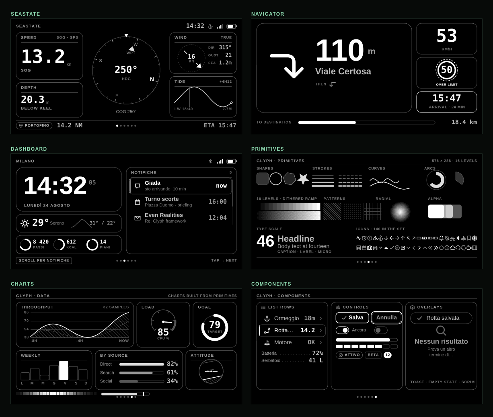

# Glyph

A graphics and UI framework for the **Even Realities G2**.

Glyph exists so that G2 apps can look like designed interfaces instead of collections of text containers and hand-placed polygons. You draw a complete screen into a 576×288 framebuffer using real primitives — paths, gradients, clipping, transforms, measured text — and Glyph slices it into image tiles and ships only the ones that changed.



## Why a framebuffer

The G2 exposes container primitives, not a graphics API. You can position text and blit images; you cannot draw an arc, clip a rotating horizon to a circle, or measure a string before you place it.

Glyph treats the display as what it is — a 576×288 surface with 16 levels of gray — and puts a full rasterizer in front of it. The SDK becomes transport. Nothing above `GlyphRuntime` knows it exists, which is also why the entire framework can be rendered and tested in a headless browser.

```ts
import { GlyphFrame } from "./glyph";

const frame = new GlyphFrame({ supersample: 2 });

frame.draw((g) => {
  g.roundRect({ x: 16, y: 16, width: 240, height: 80 }, 14, { fill: 2, stroke: 8 });
  g.gradient({ x: 16, y: 110, width: 240, height: 40 }, 0, 15);
  g.text("13.2", 32, 44, { size: 40, weight: 800 }, 15);
});

await runtime.render(frame.toFrame());
```

Levels are integers `0`–`15`, not CSS colors. `gray` in the theme names them by role — `surface`, `border`, `secondary`, `strong`, `max` — which is what keeps six screens looking like one product.

## Install

```bash
git clone https://github.com/gabrielevierti/glyph
cd glyph
npm install
npm run dev
```

Open the Vite URL. You get the six screens above at 2× with nearest-neighbour scaling — real pixels, not an interpolation of them — plus a tile-layout switcher, a pixel/tile grid overlay, and a live readout of how many tiles the transport is actually sending.

`←` `→` or space to page, `↑` `↓` to scroll inside a screen, `1`–`6` to jump.

Requires Node 20+.

## Architecture

```text
your screen                     plain object with a render(ctx) function
    │
    ▼
components · charts · icons     built entirely from the layer below
    │
    ▼
GlyphRaster                     every primitive, drawn supersampled
    │
    ▼
GlyphFrame                      resolve → 16 levels → tile → pack Gray4 → hash
    │
    ▼
GlyphRuntime                    diff against last frame, send only what changed
    │
    ▼
@evenrealities/even_hub_sdk → Even Hub → G2
```

`GlyphRuntime` is deliberately **not** exported from `index.ts`. Import it explicitly when you need transport. Keeping the SDK out of the core is what makes the whole framework testable without hardware.

## The primitive layer

Everything takes a geometry and a single `Paint` (`fill`, `stroke`, `width`, `dash`, `cap`, `join`, `alpha`), so nothing has a bespoke signature.

| | |
|---|---|
| **Shapes** | `rect` `roundRect` (per-corner radii) `circle` `ellipse` `arc` `sector` `ring` `polygon` `regularPolygon` `star` `polyline` `line` `hline` `vline` `pixel` |
| **Curves** | `spline` (Catmull-Rom) `bezier` `quad` `path` — plus `GlyphPath` and `parsePath` for reusable path data |
| **State** | `save` `restore` `scoped` `translate` `rotate` `rotateAbout` `scaleBy` `clipRect` `clipRound` `clipCircle` `clipPath` |
| **Tone** | `gradient` `radialGradient` `ditherRect` `hatch` `dots` `gridLines` `blit` `layer` `drawRaster` |
| **Text** | `text` `textBox` (wrap, align, ellipsis) `measure` `capHeight` — and `wrap` `truncate` `fitStyle` standalone |

**On tone:** Canvas gradients band badly once you quantize to 16 levels. `gradient`, `radialGradient` and `ditherRect` compute the ramp per logical pixel and apply a 4×4 ordered dither, which is the difference between a ramp and a staircase. See the Primitives screen.

**On supersampling:** the raster draws at 2× (or 3×) and averages down. On a display this small that averaging is what turns edge coverage into gray levels — you get clean diagonals and curves for free, without a custom antialiaser.

## Layout, type and icons

`row` and `column` are a real flex solver — fixed sizes, `grow(n)` weights, gaps, padding, `justify`, `align` — returning plain rects. There is no retained tree; on a screen this size a full repaint is cheaper than reconciling one.

```ts
const [left, centre, right] = row(safe, [{ size: 166 }, { size: grow(1) }, { size: 166 }], { gap: 8 });
```

Also `splitH` `splitV` `grid` `inset` `align` `aspectFit` `snap` `polar` `bearingToAngle` `remap`.

The type scale steps aggressively, because on a waveguide there is no useful middle ground between "read this" and "see this": `hero` `display` `headline` `title` `body` `caption` `label` `micro` `numeral` `numeralLg` `numeralXl`.

**140 icons**, authored as stroked path data on a 24×24 grid and parsed once. Stroked rather than filled — a filled silhouette turns to mush at 10px on this display, strokes stay separable. Add your own with `registerIcon(name, pathData)`.

## Components and charts

The convenience layer, all built from primitives: `panel` `section` `divider` `metric` `stat` `keyValue` `listRow` `progressBar` `segmentedBar` `battery` `signalBars` `statusBar` `pageDots` `tabBar` `scrollbar` `pill` `tag` `badge` `button` `toggle` `toast` `emptyState` `scrim`.

Instruments, because a marine or navigation app needs them and nothing else provides them: `compassRose` (rotating card, fixed lubber line, secondary pointer), `attitudeIndicator`, `windIndicator`, `speedLimit`, `maneuverArrow`.

Charts: `lineChart` `barChart` `rankChart` `scatterChart` `sparkline` `ringChart` `gaugeChart` `heatStrip` `bulletChart`, plus `chartFrame` if you want the grid and gutter but your own marks.

One rule the components follow: **the type scale yields to the box, not the other way round.** `metric` and `ringChart` shrink their value via `fitStyle` until it fits, because a readout is the one thing a design cannot control the length of — `9.1` and `247.8` want the same slot.

## The app shell

```ts
import { GlyphApp } from "./glyph";
import { GlyphRuntime } from "./glyph/runtime.js";

const app = new GlyphApp({ screens, tileLayout: TILE_192x96, fps: 20 });
app.start();

const runtime = new GlyphRuntime({ tileLayout: TILE_192x96 });
await runtime.start();
app.attachRuntime(runtime);
runtime.onInput((event) => app.handleInput(event));
```

A screen is a plain object:

```ts
export const myScreen: Screen = {
  name: "Depth",
  animated: true,                       // repaint every tick, not just on invalidate()
  onInput(event, app) { /* return true to consume */ },
  render({ g, now, safe, app }) { /* draw */ }
};
```

The paint loop does nothing when nothing changed. Screen changes slide via offscreen layers. `Cursor` handles selection and scrolling for list screens.

## Tile layouts

The G2's per-container size ceiling varies by firmware, so the same surface ships in four tilings:

| Layout | Tile | Tiles | Notes |
|---|---|---|---|
| `TILE_288x144` | 288×144 | 4 | Matches the official SDK reference. Fewest transfers. |
| `TILE_192x144` | 192×144 | 6 | |
| `TILE_192x96` | 192×96 | 9 | Preview default. Safest on current firmware, finest diff granularity. |
| `TILE_144x144` | 144×144 | 8 | |

All four are asserted to cover 576×288 exactly once. Out-of-bounds tiles and odd tile widths throw at construction rather than silently corrupting rows.

If `createStartUpPageContainer` fails, try a smaller layout first — that is almost always the cause.

## Transport and dirty tiles

Each tile is packed to Gray4 (two pixels per byte, high nibble first) and hashed with FNV-1a. `GlyphRuntime` compares against the previous frame and sends only tiles that changed.

Measured on the ticking Dashboard: **one tile of nine per second.** Identical renders provably hash identically, which is what makes the optimization safe. `runtime.invalidate()` forces a full repaint; `disableDiffing: true` turns it off.

Tiles go over the wire as PNG, because that is what the image containers accept today. The Gray4 packing is not wasted work — it is the diffing key and the wire format the moment raw uploads are exposed. `GlyphRuntime.encodeTile` is the single place that would change.

## Testing

```bash
npm test        # 29 assertions, rendered in real Chromium
npm run snapshot   # re-render img/screens/*.png and img/splash.png
```

Glyph's output is pixels, so the only test worth writing is one that rasterizes. Vite serves the TypeScript, Playwright opens the suite. It covers Gray4 round-tripping, tile-layout coverage and rejection, hash stability, dirty-tile counts, text wrap/truncate bounds, flex arithmetic, every screen rendering clean at four timestamps, safe-area edge bleed, and the app shell's paint loop and input routing.

The three reference screens double as the visual regression suite.

## On device

```bash
npm run host                              # vite on 0.0.0.0
npx evenhub qr --url http://YOUR_LAN_IP:5173
```

Scan from the Even companion app with the G2 paired; laptop and phone on the same network. Or use the simulator: `npm run dev` in one terminal, `npm run sim` in another.

```bash
npm run pack     # .ehpk for the Even Hub developer portal
```

## Known limitations

- **Text is browser-rasterized**, so glyph metrics depend on the host's fonts. The layout adapts (everything is measured), but exact line breaks shift between machines. A bundled bitmap font is the fix.
- **`runtime.ts` is the one file never executed in CI** — it needs the SDK and real hardware. Test it first on device.
- **`statusBar` assumes a 576-wide surface.** It is chrome, not a component.
- **No headless rendering outside a browser.** `GlyphRaster` takes an injected `createCanvas`, so a node-canvas backend is a small change, but it is not written.
- **Dirty tracking is per tile, not per region.** A one-pixel change repaints its whole tile.

## Roadmap

**0.3 — text and layout**
- [ ] bitmap font pipeline, so rendering is host-independent
- [ ] intrinsic sizing (`size: "auto"` measuring its own content)
- [ ] scroll containers with clipping built in

**0.4 — tooling**
- [ ] framebuffer inspector with per-tile byte counts
- [ ] frame capture and GIF recording from the preview
- [ ] pixel-diff assertions against committed snapshots

**0.5 — transport**
- [ ] raw Gray4 upload when the SDK exposes it
- [ ] sub-tile dirty regions

## License

MIT
